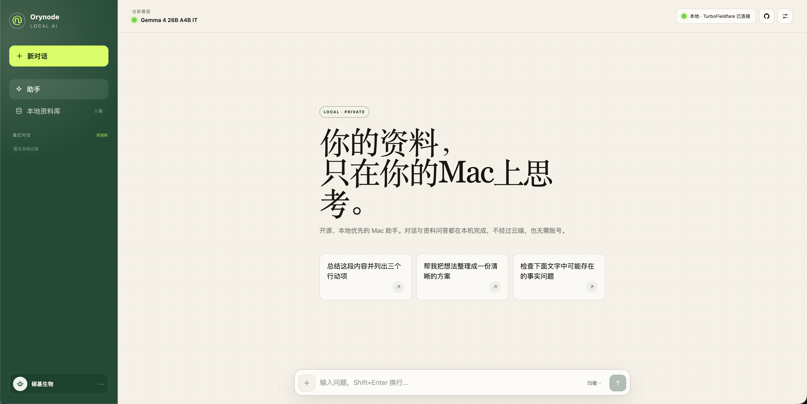
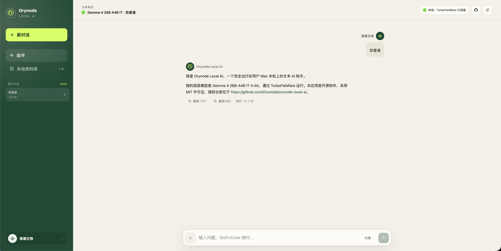
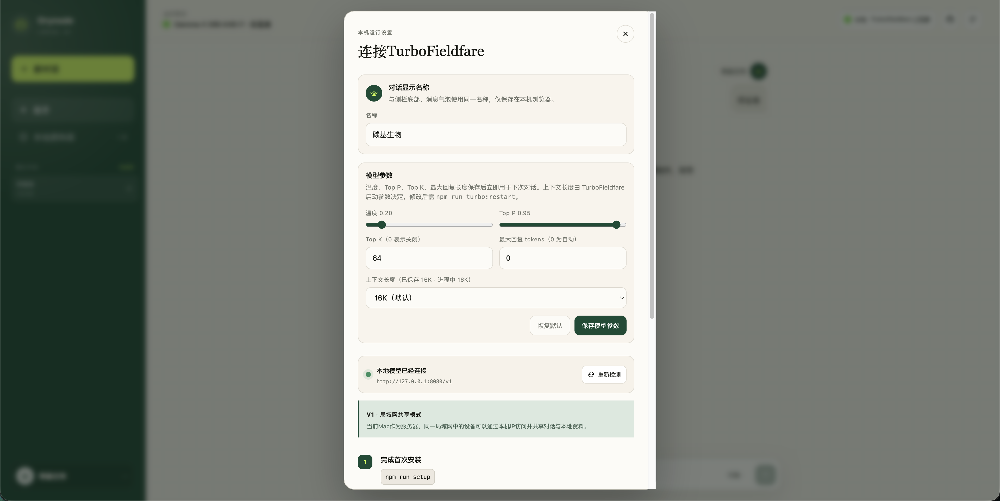

# Orynode Local AI

[简体中文](README.md) | [English](README_EN.md)

Orynode Local AI 是一款面向 Apple Silicon Mac 的开源、本地优先 AI
助手。它在 TurboFieldfare 和 Gemma 4 之上提供浏览器操作界面，让用户无需使用原始命令行对话工具，也能在自己的 Mac 上使用本地模型。

## 界面预览

### 首页



### 对话



### 设置



## 发布阶段

当前版本为 **V1：源码安装版**。用户通过 npm 安装和启动项目。这样可以让第一个公开版本保持完全开源，同时避免分发未经签名的 macOS 应用。

V2 将提供经过签名的 macOS 启动器和 DMG 安装包。启动器会复用 V1
已经建立的本地 API、模型目录、Web 界面和 TurboFieldfare 运行结构。详情请参阅[中文路线图](docs/ROADMAP_zh-CN.md)。

## 当前功能

- 本地 Web 对话（流式输出、停止生成、自动滚动）
- TurboFieldfare 连接状态与当前模型显示
- OpenAI 兼容对话接口代理
- 可复现的 TurboFieldfare 安装流程
- 支持断点续传的 Gemma 4 模型安装
- 一条命令同时启动模型和 Web 界面
- 使用本地 SQLite 自动保存和恢复对话
- 本地 PDF / TXT / Markdown 导入与基于原文的资料问答（可选语义向量：`ORYNODE_SEMANTIC_SEARCH=1`）
- 设置页与对话框可配置模型采样参数（上下文长度需重启后生效）
- 无需账号，不包含统计分析，不在云端保存对话
- 支持桌面端和移动端浏览器，以及可信局域网共享

## 系统要求

- Apple Silicon Mac
- Node.js 22.13 或更高版本
- Xcode 26 和 Swift 6.2 或更高版本
- 大约 16 GB 可用存储空间

## 首次安装

```bash
npm install
npm run setup
```

模型安装过程需要下载大约 15 GB 数据。下载中断后可以继续，并会在完成后校验模型文件。
首次安装会创建新的下载任务；只有检测到已有断点记录时才会进入续传模式。
安装期间会显示完成百分比、已下载容量、下载速度和预计剩余时间。

如果下载已经在另一个终端运行，可以打开新的终端执行：

```bash
npm run model:progress
```

单独查看当前进度不会中断或重新启动下载。

`npm run setup` 会先安装 TurboFieldfare，再下载模型。也可以分别执行
`npm run turbo:install` 和 `npm run model:install`。

## 日常启动

```bash
npm run local
```

启动后终端会显示两类地址：

- 当前 Mac 使用 `http://localhost:3000`；
- 同一局域网的电脑使用终端显示的 `http://本机IP:3000`。

所有设备共享服务器 Mac 上的对话、本地资料和本地模型。只有 Web 入口会监听局域网；TurboFieldfare 和 SQLite 数据服务仍只监听 `127.0.0.1`。

V1 暂无用户账号和访问权限，请只在可信局域网使用，不要将 3000 端口映射到公网。按下 `Control+C` 可以停止服务。

如果你已经单独管理 TurboFieldfare，可以执行 `npm run dev`，只启动 Web
界面。如需修改本地 API 地址，请将 `.env.example` 复制为
`.env.local`，然后修改其中的配置。

## 项目结构

```
orynode-local-ai/
├── app/                          # Next.js 前端 (页面、组件、API 路由)
│   ├── page.tsx                  #   入口页面（组件编排）
│   ├── components/               #   UI 组件 (chat/knowledge/sidebar/settings/ui)
│   ├── hooks/                    #   自定义 Hooks (useChat/useKnowledge/useConversations/useSettings)
│   └── api/                      #   API 路由 (chat/status/conversations/knowledge/settings)
├── services/                     # 核心业务逻辑（纯 TypeScript）
│   ├── chat/                     #   System prompt
│   ├── inference/                #   TurboFieldfare 适配（chat/status 共用）
│   ├── knowledge/                #   解析/分块/可选向量/检索（唯一智能）
│   └── settings/                 #   运行时设置
├── config/                       # 集中配置
│   └── defaults.ts
├── scripts/                      # 运维脚本
│   ├── start-local.mjs           #   一键启动
│   ├── local-data-service.mjs    #   薄存储层（:4318，SQLite）
│   └── ...
├── worker/                       # vinext 本地运行时入口（非云端业务）
├── db/                           # 说明：业务数据不在此，见 README
├── .orynode/                     # 运行时数据（gitignore）
│   ├── data/orynode.db           #   SQLite（对话 + 知识库）
│   ├── knowledge/files/          #   已上传资料（PDF / TXT / MD）
│   └── models/                   #   Gemma 4 模型
└── docs/                         # 文档
    └── ARCHITECTURE_zh-CN.md     #   架构说明
```

### 三层服务架构

```
浏览器 (3000)
  → Orynode Web 界面（Next.js + React）
    ├── TurboFieldfareServer (127.0.0.1:8080) — 模型推理
    └── Orynode 数据服务 (127.0.0.1:4318)    — SQLite + 资料存储
  → Gemma 4 模型 (.orynode/models/)
```

只有 Web 界面监听局域网；推理服务和数据库始终绑定 `127.0.0.1`。

完整的架构说明、服务分层、数据流、知识库/RAG 系统设计和扩展接口，请参阅**[架构文档](docs/ARCHITECTURE_zh-CN.md)**。

## 隐私说明

默认情况下，提示词和生成结果只会发送给本机运行的 TurboFieldfare
服务，并保存在本机SQLite数据库。本项目不包含分析统计或遥测功能。首次安装模型需要联网下载模型文件。

本地运行可以减少资料被发送到外部服务器的风险，但不能代替设备安全、访问控制和备份措施。重要资料仍应由用户自行保护。

## 独立项目声明

这是一个独立的社区项目，与 Google 和 TurboFieldfare 作者不存在隶属、赞助或背书关系。

准备分发构建版本前，请阅读：

- [第三方项目声明](THIRD_PARTY_NOTICES.md)
- [隐私说明](PRIVACY.md)
- [安全说明](SECURITY.md)
- [架构文档](docs/ARCHITECTURE_zh-CN.md)
- [故障排查](docs/TROUBLESHOOTING_zh-CN.md)

## 贡献说明

当前阶段**不接受外部 Pull Request / 代码贡献**。欢迎通过 Issues 反馈问题或建议，详见 [CONTRIBUTING_zh-CN.md](CONTRIBUTING_zh-CN.md)。

## 开源许可证

Orynode Local AI 使用 [MIT License](LICENSE)。

Copyright (c) 2026 Orynode。
