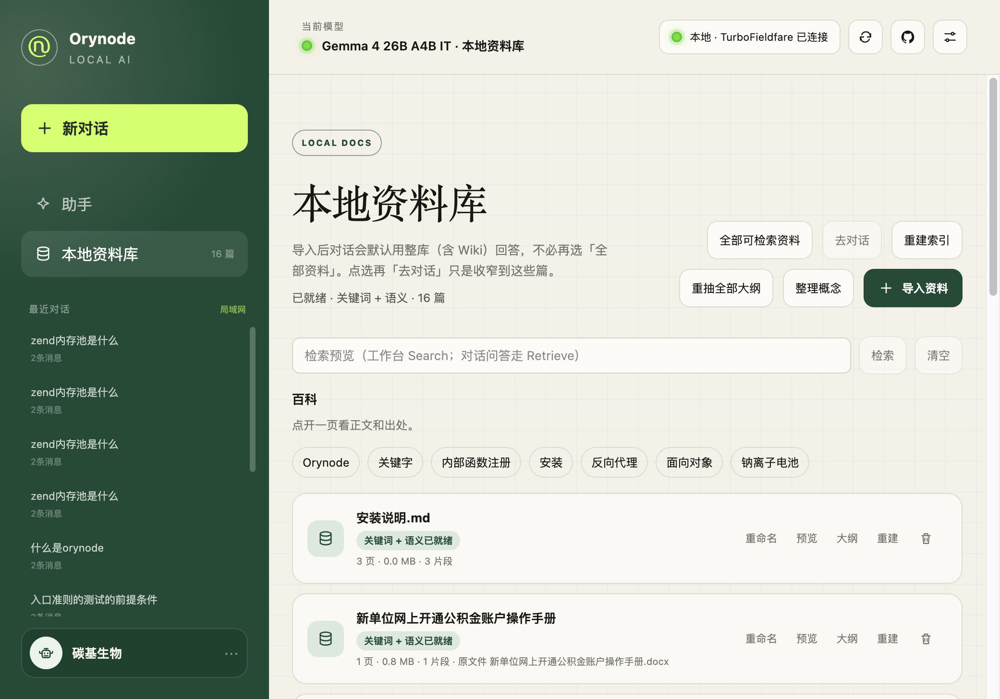
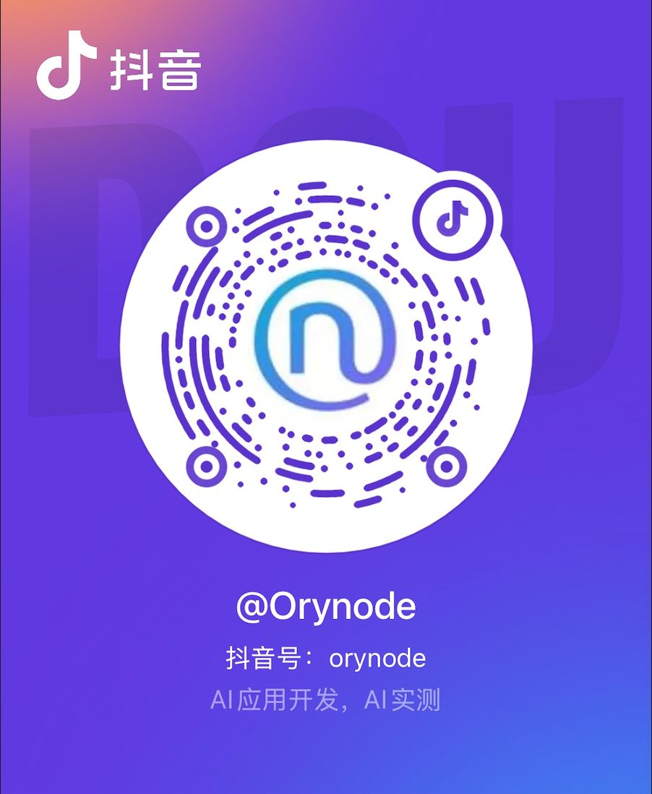

# Orynode Local AI

[简体中文](README.md) | [English](README_EN.md)

Orynode Local AI 是一款面向 Apple Silicon Mac 的开源、本地优先 AI
助手，也致力于把用户自己的 Mac 变成一台私有 AI 服务器。它在 TurboFieldfare 和 Gemma 4 之上提供浏览器操作界面，让用户无需使用原始命令行对话工具，也能在自己的 Mac 上使用本地模型；模型推理、会话和知识数据默认留在服务器 Mac 本机。

## 界面预览

### 首页


### 对话


### 本地资料库



### 设置


## 发布阶段

当前版本为 **V1：源码安装版**（npm 包版本见 `package.json` / [CHANGELOG](CHANGELOG.md)）。用户通过 npm 安装和启动项目。这样可以让第一个公开版本保持完全开源，同时避免分发未经签名的 macOS 应用。

V2 将提供经过签名的 macOS 启动器和 DMG 安装包。启动器会复用 V1
已经建立的本地 API、模型目录、Web 界面和 TurboFieldfare 运行结构。详情请参阅[中文路线图](docs/ROADMAP_zh-CN.md)。

## 当前功能

- 本地 Web 对话（流式输出、停止生成、自动滚动；Orynode SSE v1 + 结构化引用）
- **RAG / Knowledge Engine**（1.1.0 主链路 + **1.2.0** 检索闭环）：Scope 授权、Hybrid、可学习 Query Rewrite、词法阶梯、Citation、ProcessingBuild、处理队列、知识工作台 Search 预览
- TurboFieldfare 连接状态与当前模型显示（经 ModelRuntime，不直连）
- OpenAI 兼容对话接口代理
- 可复现的 TurboFieldfare / Gemma 4 安装；一条命令同时启动模型与 Web
- 本地 SQLite 自动保存对话；会话附件与持久资料库双命名空间
- 本地 PDF / TXT / Markdown；扫描 PDF 可经 **Apple Vision OCR** 进索引
- 设置页：采样参数、知识检索档位（自动 / 省资源 / 更高质量）、OCR 模式、Trusted-LAN 配对
- 默认关键词检索；可选语义向量（`multilingual-e5-small` 等，需显式开启）
- 无需账号，不包含统计分析，不在云端保存对话
- 支持桌面端和移动端浏览器；Trusted-LAN 需配对会话（UNSAFE 仅为预览）
- **Windows**：仅架构预留（ModelRuntime / OCR stub），本版完整体验面向 Apple Silicon Mac

## 模型与技术

| 类别 | 技术 | 说明 |
|------|------|------|
| 对话模型 | Gemma 4 26B A4B IT（4-bit） | 本机生成；经 TurboFieldfare（Metal） |
| 推理运行时 | TurboFieldfare | `:8080/v1`；仅监听 `127.0.0.1` |
| 默认检索 | SQLite FTS5 + 中文 bigram | 不开向量模型即可用 |
| 可选向量后端 | blob_scan（BLOB + JS 余弦） | 生产固定；sqlite-vec 仅占位，**大量数据瓶颈时再评估** |
| 可选 Embedding | multilingual-e5-small（默认推荐） | ONNX / `@xenova/transformers`；中英 |
| Embedding 兼容 | bge-small-zh-v1.5 | 旧索引对照；勿与 E5 混用 |
| OCR | Apple Vision（`orynode-ocr`） | macOS；Windows 预留 PP-OCR/ONNX stub |
| 应用栈 | Next.js · React · vinext · TypeScript · SQLite | 本地 Web + Data Service `:4318` |

完整清单与版本边界见 [CHANGELOG 1.2.0](CHANGELOG.md#120--2026-08-05)（KE 首发基线：[1.1.0](CHANGELOG.md#110--2026-08-03)）。

## 本地资料与检索

文件分两个命名空间（对齐常见聊天产品心智）：

| 入口 | 落点 | 生命周期 |
|------|------|----------|
| 对话「附到本对话」/ 拖拽 | 会话附件 | 随对话删除；检索 API 按 `conversationId` 校验归属，仅本会话可用 |
| 「导入资料库」或资料库页导入 | 持久资料库 | 长期保留；**按文件内容去重**（与显示名无关） |

处理流程（两条入口共用 **Knowledge Engine** 摄取管线）：

1. **解析**：按类型提取文本（PDF / TXT / Markdown）；扫描/混合 PDF 可走 Apple Vision OCR（`process_revision` Job）
2. **分块 / 索引**：切成可检索片段写入 SQLite；资料库入库前内容哈希去重
3. **检索**：按**本轮消息**勾选范围 → `HybridRetriever`（默认 FTS；可选向量 + RRF）→ 注入上下文并带结构化引用
4. 草稿选中发送后清空；打开历史不自动恢复上次勾选，但可再次从本会话附件列表选择

资料库显示名可在导入时填写，也可事后重命名；改名不会重建索引。

**默认只做关键词检索**（FTS5），不加载向量模型。已选资料但 0 命中时，会向模型注入诚实说明，不会乱塞片段。

若要开启**语义向量检索**（需本机加载 ONNX）：

1. 复制 `.env.example` → `.env.local`
2. 设置 `ORYNODE_SEMANTIC_SEARCH=1`（可选 `ORYNODE_EMBEDDING_ARTIFACT=multilingual-e5-small`）
3. 可选 `npm run embedding:install`；重启 `npm run local`
4. 设置页知识档位选「自动 / 更高质量」时，在主机开启语义后才会融合向量

开启后新文档异步写向量（`ready` → `embedding` → `indexed`）；旧文档可重建索引。**切换 Embedding artifact 后必须重建向量索引**，禁止混用。

> **评测说明**：CI `test:retrieval-eval` 以关键词门禁为主；真实 embedding 召回质量评测另开里程碑。

当前实现：[架构文档](docs/ARCHITECTURE_zh-CN.md)。RAG 设计与完成度：[Knowledge Engine](docs/knowledge-engine/README.md)、[RAG 升级闭环](docs/knowledge-engine/RAG_UPGRADE_CLOSED_LOOP_zh-CN.md)、[CHANGELOG](CHANGELOG.md)。

## 系统要求

- Apple Silicon Mac
- Node.js 22.13 或更高版本
- Xcode 26 和 Swift 6.2 或更高版本
- 大约 16 GB 可用存储空间

## 首次安装

```bash
npm install
npm run setup
```

模型安装过程需要下载大约 15 GB 数据。下载中断后可以继续，并会在完成后校验模型文件。
首次安装会创建新的下载任务；只有检测到已有断点记录时才会进入续传模式。
安装期间会显示完成百分比、已下载容量、下载速度和预计剩余时间。

如果下载已经在另一个终端运行，可以打开新的终端执行：

```bash
npm run model:progress
```

单独查看当前进度不会中断或重新启动下载。

`npm run setup` 会依次：安装 TurboFieldfare（若尚未安装）→ 下载模型 → 编译并安装本机 OCR helper（Apple Vision，产出 `.orynode/bin/orynode-ocr`，供扫描/混合 PDF 文字识别）。也可以分别执行：

```bash
npm run turbo:install   # TurboFieldfare
npm run model:install   # Gemma 4 模型
npm run ocr:install     # OCR helper（需 Swift；非 macOS 会跳过）
npm run ocr:bench       # OCR micro-bench（默认 Fake；真机加 ORYNODE_OCR_BENCH_REAL=1）
```

`npm run doctor` 可检查 OCR helper 是否可用。

## 日常启动

```bash
npm run local
```

启动后终端会显示本机地址 `http://localhost:3000`。若设置
`ORYNODE_ACCESS_MODE=trusted_lan`，还会显示局域网地址，并要求设备完成配对
（本机设置页「Trusted-LAN 配对」生成码，设备 `POST /api/lan/pairing` claim）。

只有 Web 入口会监听局域网；TurboFieldfare 和 SQLite 数据服务仍只监听
`127.0.0.1`，不直接暴露。

Trusted-LAN 正式路径使用一次性配对码与可撤销会话；
`ORYNODE_TRUSTED_LAN_UNSAFE=1` 仅为**无认证开发预览**，不得当作安全共享模式，
也不要映射 3000 端口到公网。按下 `Control+C` 可以停止服务。

如果你已经单独管理 TurboFieldfare，可以执行 `npm run dev`，只启动 Web
界面。如需修改本地 API 地址，请将 `.env.example` 复制为
`.env.local`，然后修改其中的配置。

## 项目结构

```
orynode-local-ai/
├── app/                          # Next.js 前端 (页面、组件、API 路由)
│   ├── page.tsx                  #   入口页面（组件编排）
│   ├── components/               #   UI 组件 (chat/knowledge/sidebar/settings/ui)
│   ├── hooks/                    #   自定义 Hooks (useChat/useKnowledge/useConversations/useSettings)
│   └── api/                      #   API 路由 (chat/status/conversations/knowledge/settings)
├── services/                     # 核心业务逻辑（纯 TypeScript）
│   ├── chat/                     #   Prompt / SSE v1 / 上下文预算
│   ├── platform/                 #   Host / ModelRuntime / LAN / OCR 装配（含 Windows stub）
│   ├── knowledge/                #   Knowledge Engine：解析/分块/检索/OCR 管线
│   ├── agent/                    #   受控知识工具 + Agent space（无 UI 主路径）
│   └── settings/                 #   运行时设置
├── native/macos/orynode-ocr/     # Apple Vision OCR helper（源码；.build 不入库）
├── config/                       # defaults + embedding-artifacts
├── scripts/                      # 运维 + data-service 模块
│   ├── start-local.mjs
│   ├── local-data-service.mjs
│   └── data-service/             #   FTS / jobs / worker / OCR blocks / LAN…
├── worker/                       # vinext 本地运行时入口
├── .orynode/                     # 运行时数据（gitignore）
│   ├── data/orynode.db
│   ├── bin/orynode-ocr           #   OCR 可执行文件（install 产出）
│   ├── knowledge/files/
│   └── models/                   #   Gemma 4
└── docs/
    ├── ARCHITECTURE_zh-CN.md
    └── knowledge-engine/         #   RAG / KE 设计与完成度（1.2.0）
```

### 三层服务架构

```
浏览器 (3000)
  → Orynode Web 界面（Next.js + React）
    ├── TurboFieldfareServer (127.0.0.1:8080) — 模型推理
    └── Orynode 数据服务 (127.0.0.1:4318)    — SQLite + 资料存储
  → Gemma 4 模型 (.orynode/models/)
```

只有 Web 界面监听局域网；推理服务和数据库始终绑定 `127.0.0.1`。

完整的架构说明、服务分层、数据流、知识库/RAG 系统设计和扩展接口，请参阅**[架构文档](docs/ARCHITECTURE_zh-CN.md)**。

## 隐私说明

默认情况下，提示词和生成结果只会发送给本机运行的 TurboFieldfare
服务，并保存在本机SQLite数据库。本项目不包含分析统计或遥测功能。首次安装模型需要联网下载模型文件。

本地运行可以减少资料被发送到外部服务器的风险，但不能代替设备安全、访问控制和备份措施。重要资料仍应由用户自行保护。

## 独立项目声明

这是一个独立的社区项目，与 Google 和 TurboFieldfare 作者不存在隶属、赞助或背书关系。

准备分发构建版本前，请阅读：

- [第三方项目声明](THIRD_PARTY_NOTICES.md)
- [隐私说明](PRIVACY.md)
- [安全说明](SECURITY.md)
- [架构文档](docs/ARCHITECTURE_zh-CN.md)
- [Knowledge Engine 文档索引](docs/knowledge-engine/README.md)
- [AI Knowledge Engine 长期架构](docs/knowledge-engine/KNOWLEDGE_ENGINE_ARCHITECTURE_zh-CN.md)
- [AI Knowledge Engine 架构符合性审计与整改实施计划](docs/knowledge-engine/KNOWLEDGE_ENGINE_IMPLEMENTATION_PLAN_zh-CN.md)
- [故障排查](docs/TROUBLESHOOTING_zh-CN.md)

## 贡献说明

当前阶段**不接受外部 Pull Request / 代码贡献**。欢迎通过 Issues 反馈问题或建议，详见 [CONTRIBUTING_zh-CN.md](CONTRIBUTING_zh-CN.md)。

## 抖音

扫码关注 **@Orynode**（抖音号：`orynode`），了解 AI 应用开发与实测动态。

<p align="center">
  
</p>

## 开源许可证

Orynode Local AI 使用 [MIT License](LICENSE)。

Copyright (c) 2026 Orynode。
